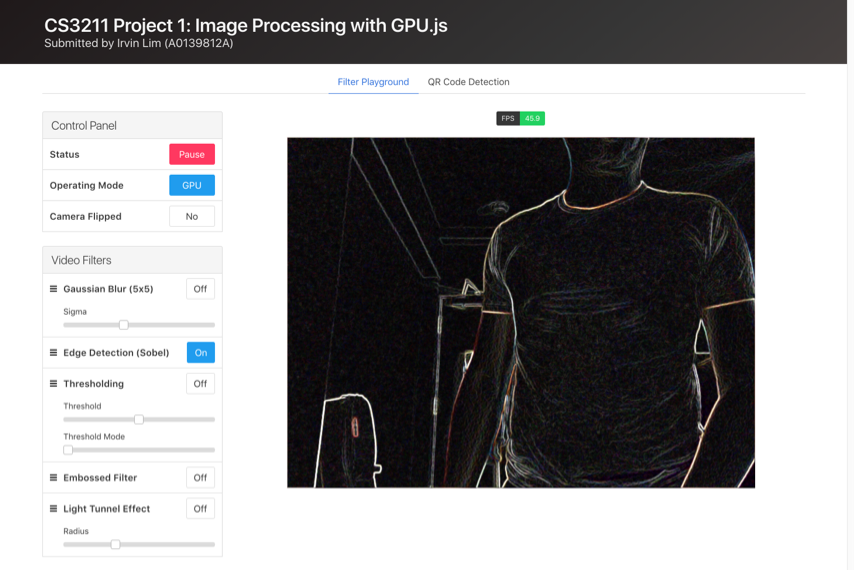
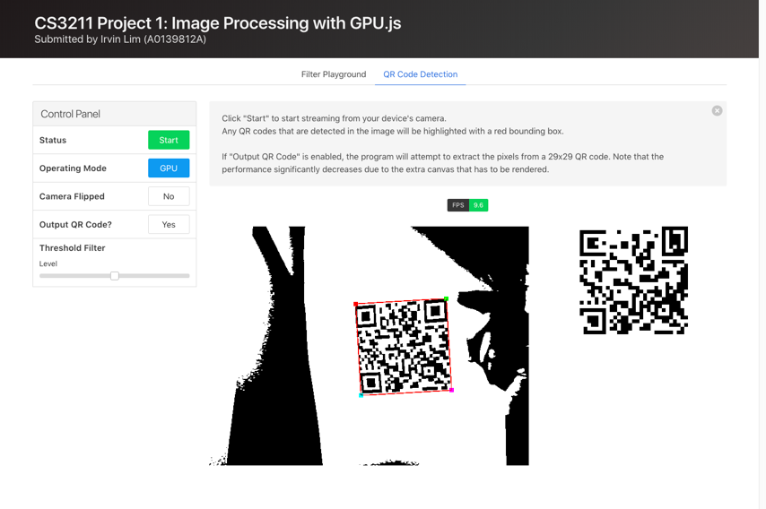

# CS3211 Project 1

_Submitted by Irvin Lim Wei Quan (A0139812A)._

This is a submission for CS3211 Parallel and Concurrent Programming, Project 1 (_Image Processing: Implementation and Analysis_).

The complete project report can also be found in the root directory.

## Demo

A demo of the implementation for Part 3, video filters and QR code detection with [GPU.js](https://github.com/gpujs/gpu.js), is available at [https://irvinlim.github.io/cs3211-project-1/part3/filters.html](https://irvinlim.github.io/cs3211-project-1/part3/filters.html).

Some screenshots:





## Part 1

Various scripts that were used for benchmarking and automating the tests on the lab machine and the Tembusu cluster can be found in the `part1` directory, in case you might find them useful.

Additionally, the raw output for some of the lab tasks are also stored here for scratch work.

## Part 2

The `part2` directory contains the various HTML files showing the iterative testing and improvement of the program to investigate the low framerate, as well as to improve the framerate. These files are named `testXX.html`.

You can do a diff on the files to find out what was changed between each step, like as follows:

```sh
diff test01.html test02.html
```

## Part 3

### Setup Instructions

This program runs in the browser, preferably on Google Chrome. As it requires access to the device's camera, it must be run on the `http` protocol instead of the `file` protocol.

The solution is to start a static HTTP server, such as Python 3's [`http.server`](https://docs.python.org/3/library/http.server.html) or in Node.js, [`http-server`](https://www.npmjs.com/package/http-server).

For `http.server` (Python 3):

```sh
# Runs a static server on localhost:8000
python -m http.server
```

For `SimpleHTTPServer` (Python 2):

```sh
# Runs a static server on localhost:8000
python -m SimpleHTTPServer
```

Otherwise, for `http-server` (Node.js):

```sh
# Install http-server globally
npm i -g http-server

# Runs a static server on localhost:8080
http-server
```

### Usage

There is an attached sample QR code which to be used within the application:


### Dependencies

This project depends on [GPU.js](https://github.com/gpujs/gpu.js), as well as some auxiliary UI libraries [Bulma](https://bulma.io/) and [html5sortable](https://github.com/lukasoppermann/html5sortable).

As this is a submission for a school assignment, all dependencies are copied into this repository directly, instead of typically installing them from NPM.

## License

Copyright, Irvin Lim
